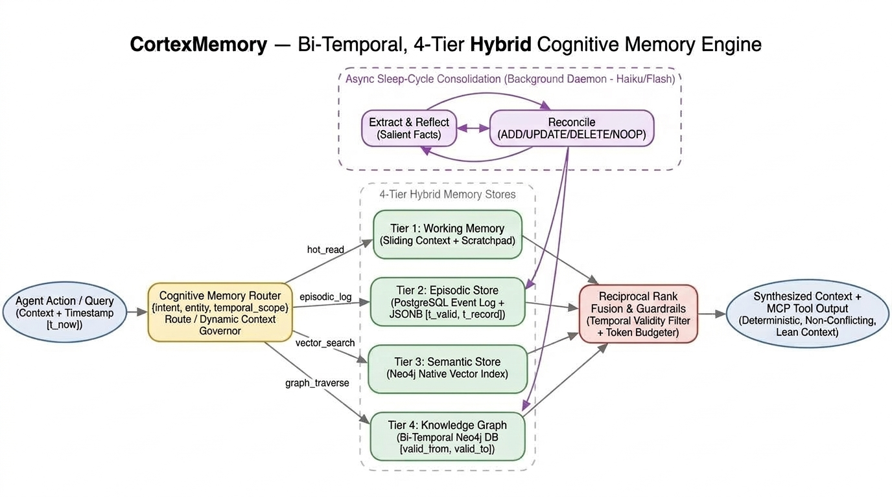

# CortexMemory

> **Bi-Temporal, 4-Tier Hybrid Cognitive Memory Engine for Autonomous Coding Agents**

CortexMemory is an external cognitive memory engine that connects to your preferred AI coding agent via the **Model Context Protocol (MCP)**. By decoupling short-term working context from long-term memory, it keeps active prompts lean and stationary ($O(1)$), cutting token consumption by **~82%**, eliminating compaction amnesia, and preventing repetitive debugging loops.

All memory storage runs **100% locally on your machine using Docker** (PostgreSQL 16 + Neo4j 5.26) and local vector embeddings.

---

## Why CortexMemory?

- **Universal Agent Compatibility:** Seamlessly connects via standard MCP to **Claude Code**, **Cursor**, **Windsurf**, **Antigravity**, and **Claude Desktop**.
- **Massive Token & Cost Savings (~82%):** Instead of accumulating 160k+ tokens across 40 turns, the agent's prompt stays small and fast (~8k–12k tokens), with Cortex injecting only relevant facts capped under 2,500 tokens.
- **Privacy-First & Fully Local:** Your code history, tool outputs, diffs, and knowledge graphs reside entirely in local Docker containers.
- **No Cloud Embedding Fees:** Embeddings run locally via FastEmbed (`BAAI/bge-small-en-v1.5`) by default, with optional support for OpenAI embeddings.
- **Zero Compaction Amnesia:** Never lose track of early user constraints, test logs, or architectural decisions when the context window compacts.
- **Repetitive Bug Loop Prevention:** SHA-256 error hashing alerts the agent immediately if it attempts an identical failed fix.
- **Flexible Sleep-Cycle Consolidation:** The background distillation daemon can use lightweight cloud models (Claude 3.5 Haiku, Gemini Flash) or local models (via Ollama).

---

## Architecture Overview



CortexMemory organizes memory into **4 distinct tiers** operating across two decoupled asynchronous pathways:

| Tier | Engine | Purpose | Capacity / Performance |
| :--- | :--- | :--- | :--- |
| **Tier 1: Working Memory** | In-Memory / Python | Active goal, current debugging hypothesis, transient scratchpad notes. | Hard-capped at $4{,}000$ tokens |
| **Tier 2: Episodic Store** | PostgreSQL 16 (JSONB) | Append-only operational audit log of tool calls, git diffs, outputs, and errors. Indexed with SHA-256 for loop detection. | Sub-millisecond non-blocking writes |
| **Tier 3: Semantic Store** | Neo4j Native Vector Index | 1536-dimensional Lucene cosine similarity index over code entities and architectural decisions. | Semantic nearest-neighbor retrieval |
| **Tier 4: Knowledge Graph** | Neo4j Bi-Temporal Graph | Structural dependency graph with `[valid_from, valid_to]` intervals to track active vs. superseded code patterns. | Point-in-time Cypher traversals |

### Dual Execution Paths
1. **Hot Path (Sub-Second):** FastMCP tools log turns immediately to PostgreSQL. Queries perform hybrid search across Vector (Tier 3) and Graph (Tier 4) fused via **Reciprocal Rank Fusion (RRF)** and packed into a lean context (< 2,500 tokens).
2. **Sleep-Cycle Consolidation (Background):** A PostgreSQL trigger fires `pg_notify('new_episode_channel')`. An asynchronous daemon wakes up without polling, reflects on recent turns with a fast LLM (e.g. Claude 3.5 Haiku, Gemini Flash, or local Ollama), and reconciles the knowledge graph using 4 atomic operations (`ADD`, `UPDATE`, `DELETE`, `NOOP`).

---

## Key Use Cases

### 1. Eliminating Repetitive Debugging Loops
* **The Problem:** In extended sessions, when an agent encounters compiler errors or test failures, previous stack traces roll off the compacted context. The agent repeatedly attempts the same failed fix.
* **The Solution:** CortexMemory hashes every error with SHA-256 in PostgreSQL. If the agent encounters the same failure signature twice, Cortex immediately flags `repetitive_loop_detected: true`, halting the loop and forcing a new strategy.

### 2. Temporal Disambiguation in Major Refactors
* **The Problem:** When refactoring a codebase (e.g. moving from REST to tRPC, or SQLAlchemy to Prisma), agents get confused between obsolete instructions in git history and active conventions.
* **The Solution:** CortexMemory marks superseded architectural relationships with `valid_to = datetime()`. Point-in-time queries filter `WHERE valid_to IS NULL`, ensuring the agent only acts on active conventions while preserving historical auditability.

---

## Quickstart & Setup

### 1. Prerequisites
- [Docker & Docker Compose](https://www.docker.com/)
- Python 3.12+ and [uv](https://docs.astral.sh/uv/)

### 2. Start Infrastructure
Launch PostgreSQL 16 and Neo4j 5.26 with pre-configured schemas and APOC plugins:
```bash
docker compose -f docker/docker-compose.yml up -d
```

Verify services:
- **PostgreSQL:** `localhost:5432` (`user: cortex`, `db: cortex_memory`)
- **Neo4j Browser:** [http://localhost:7474](http://localhost:7474) (`user: neo4j`, `pass: cortex_secure_password`)

### 3. Install Dependencies & Run Tests
```bash
uv sync
uv run pytest
```
*(Runs the test suite across models, hashing, PostgreSQL, Neo4j, RRF, and FastMCP tools).*

---

## How to Use with Coding Agents

CortexMemory runs as a **FastMCP server** implementing the standard Model Context Protocol.

### Claude Code / Cursor / Windsurf Configuration

Add CortexMemory to your client's MCP configuration (e.g. `~/.claude.json` or `cursor.json`):

```json
{
  "mcpServers": {
    "cortex-memory": {
      "command": "uv",
      "args": [
        "--directory",
        "/Users/supreme/Dev/cortex-memory",
        "run",
        "python",
        "-m",
        "cortex.mcp.server"
      ]
    }
  }
}
```

### Available MCP Tools

| Tool Name | Description | Key Parameters |
| :--- | :--- | :--- |
| `cortex_record_event` | Ingests a tool call, user prompt, git commit, or error into Tier 2. | `session_id`, `turn_index`, `event_type`, `payload`, `outcome_status` |
| `cortex_query_memory` | Hybrid RRF retrieval returning synthesized, token-budgeted context. | `query`, `session_id`, `target_entity`, `max_tokens` |
| `cortex_check_error_loop` | Checks if a stack trace or error has occurred previously. | `session_id`, `error_output` |
| `cortex_update_scratchpad` | Updates active goal and hypothesis in Tier 1 Working Memory. | `session_id`, `active_goal`, `current_hypothesis`, `notes` |
| `cortex_inspect_graph` | Traverses active dependencies for a file or function in Neo4j. | `entity_id` |
| `cortex_force_consolidation` | Manually triggers background sleep-cycle distillation. | `limit` |

---

## Example Usage

### Recording an Event & Checking for Loops
```python
# The agent executes a tool that failed
response = await cortex_record_event(
    session_id="session_01",
    turn_index=12,
    event_type="test_failure",
    payload={"stderr": "AssertionError: 401 != 200 at auth.test.ts:45"},
    outcome_status="FAILED",
    target_entity="src/auth/jwt.ts"
)

# Output:
# {
#   "event_id": "c71a39...",
#   "content_hash": "8ea6c75...",
#   "repetitive_loop_detected": true,
#   "occurrence_count": 2
# }
```

### Querying Memory for Lean Context
```python
# The agent queries memory before generating code
context = await cortex_query_memory(
    query="How is authentication validated in API routes?",
    target_entity="src/api/routes.ts",
    max_tokens=1500
)

# Returns concise, token-budgeted Markdown:
# ### Active Working Scratchpad
# **Active Goal:** Migrate from REST to tRPC
# 
# ### Graph Dependencies
# - src/auth/session.ts (depth 1) [USES_PROTOCOL: tRPC]
# - src/models/user.ts (depth 2)
```

---

## License

Apache 2.0
